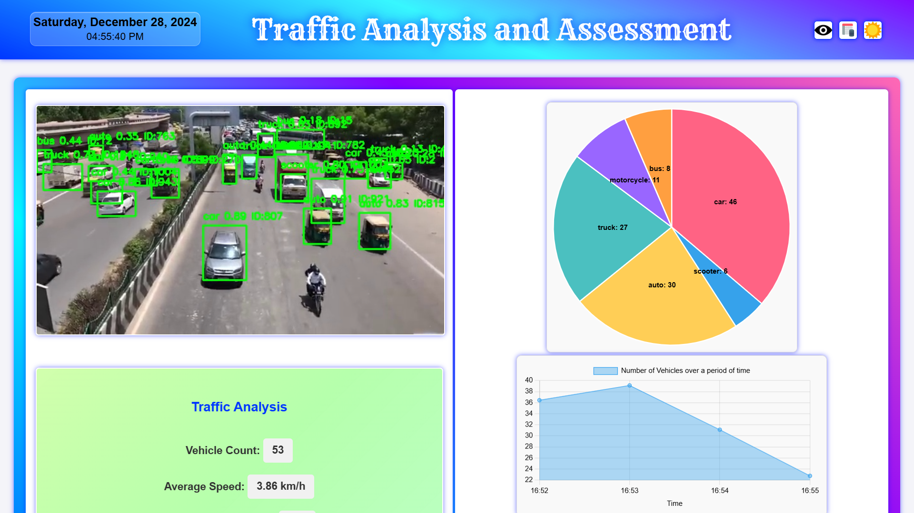
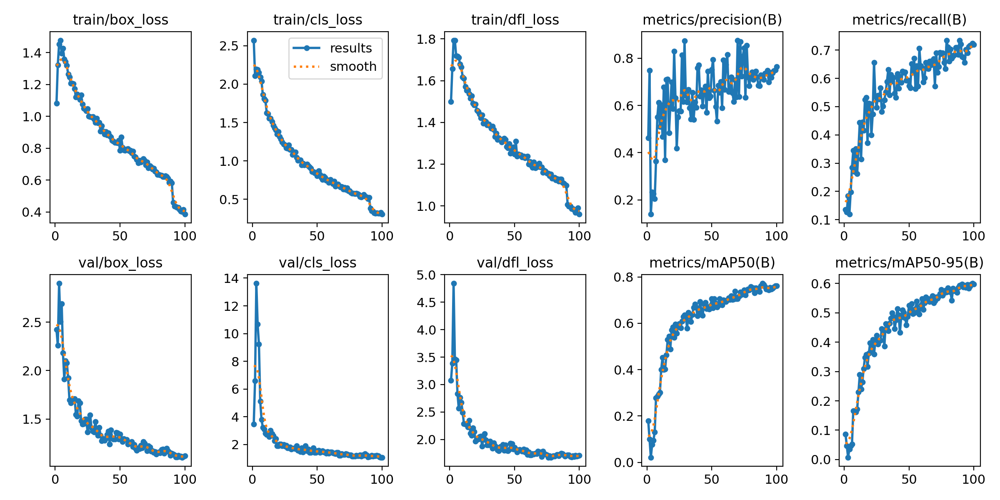

# 🚗 **Vehicle Detection and Traffic Assessment using YOLO11L** 🚦

This project is a **real-time vehicle detection and traffic assessment system** built on a self-trained **YOLO11L model**. The system integrates advanced features like **data logging**, **visualization**, and **traffic analysis** to provide actionable insights into traffic conditions.

---

## 🖼️ **Preview**

---

## ✨ **Features**

### 🚘 **Vehicle Detection**
- Detects multiple vehicle types in real-time using a **combination of the base YOLO11L model** (for pre-trained classes) and **custom-trained YOLO11L model** (for added custom classes).
- Base YOLO11L model from [Ultralytics](https://www.ultralytics.com/).

| **Model**    | **Size (pixels)** | **mAPval 50-95** | **Speed (CPU ONNX)** | **Speed (T4 TensorRT10)** | **Params (M)** | **FLOPs (B)** |
|--------------|-------------------|------------------|-----------------------|---------------------------|----------------|---------------|
| YOLOv11L     | 640               | 53.4             | 238.6 ± 1.4 ms        | 6.2 ± 0.1 ms              | 25.3           | 86.9          |

- **Custom-trained YOLO11L model** supports **80 COCO classes** and **5 additional custom classes** for vehicle detection:
  - **80: JCB**
  - **81: Auto**
  - **82: Rickshaw**
  - **83: Cart**
  - **84: Scooter**
  
- Results of training for the **Custom-trained YOLO11L model**:
  
  
  
- Achieved performance metrics on testing data:
  - **mAP50-95:** 59.5%
  - **mAP50:** 66.2%
  - **mAP75:** 61.3%

- **Class-Wise Metrics on Testing Data:**

| **Class**     | **Precision** | **Recall** | **mAP50** | **mAP50-95** |
|---------------|---------------|------------|-----------|--------------|
| Bicycle       | 0.802         | 0.844      | 0.883     | 0.804        |
| Car           | 0.779         | 0.263      | 0.321     | 0.304        |
| Motorcycle    | 0.964         | 0.787      | 0.818     | 0.785        |
| Bus           | 0.214         | 0.526      | 0.234     | 0.194        |
| Truck         | 0.645         | 0.654      | 0.654     | 0.570        |
| JCB           | 0.907         | 0.754      | 0.878     | 0.771        |
| Auto          | 0.913         | 0.766      | 0.909     | 0.807        |
| Rickshaw      | 0.862         | 0.728      | 0.868     | 0.811        |
| Cart          | 0.852         | 0.603      | 0.781     | 0.627        |
| Scooter       | 0.908         | 0.809      | 0.936     | 0.875        |

---

### 📋 **Data Logging**
- Logs detection data to **Google Sheets** for further analysis.
- Captures the following parameters:
  - **Timestamp**
  - **Bounding Box Coordinates** (X1, Y1, X2, Y2)
  - **Width and Height** of detected vehicles
  - **Class Name**
  - **Confidence Score**
  - **Track ID**

---

### 📊 **Data Visualization**
Provides real-time visual insights using **Chart.js**:
1. **Pie Chart**: Proportion of detected vehicle classes.
2. **Line Chart**: Number of vehicles detected over time.
3. **Bar Chart**: Vehicle classes with the most road occupancy, calculated by bounding box area.

---

### 🚦 **Traffic Insights**
Real-time calculations based on detection data:
- **Vehicle Count**: Total number of vehicles detected in the current frame.
- **Average Speed**: Estimates the speed of moving vehicles.
- **Traffic Jam Detection**: Identifies congestion based on density.
- **Heavy Vehicle Density**: Analyzes the proportion of heavy vehicles present.
- **Road Clearance Time**: Predicts the time required to clear the road.
- **Traffic Light Suggestions**: Recommends optimal traffic light timings based on vehicle density and flow.

---

## 🔄 **Workflow**

1. **Input Video Stream**:
   - The system uses YouTube streams as the input source.
   - Frames are extracted using OpenCV for processing.

2. **Detection and Analysis**:
   - The YOLO11L model detects vehicles and classifies them into predefined classes.
   - Detection results include bounding box dimensions, class names, confidence scores, and unique track IDs.

3. **Data Logging to Google Sheets**:
   - Detected data is dynamically updated in Google Sheets.
   - Utilizes Google Sheets API for seamless integration and real-time updates.

4. **Visualization**:
   - Chart.js fetches data from Google Sheets to render interactive charts.
   - Provides intuitive insights through pie, line, and bar charts.

5. **Traffic Insights Calculation**:
   - Algorithms calculate traffic-related metrics and predictions.
   - Displays results on the web interface for user interpretation.

---

## 🛠️ **Technical Overview**

### Backend
- **Flask Framework**: Handles application logic and APIs.
- **Flask-WTF**: Validates user inputs and forms.
- **Flask-Ngrok**: Facilitates local hosting for development purposes.
- **YOLO11L Model**: Custom-trained model for vehicle detection and classification.

### Frontend
- **Chart.js**: Enables dynamic data visualization.
- **HTML & CSS**: Renders the web interface.

### Libraries and Tools
- **OpenCV**: Processes video frames for detection.
- **Shapely**: Calculates geometric properties for bounding boxes.
- **yt_dlp**: Streams YouTube videos for input.
- **GSpread**: Integrates with Google Sheets for data logging.
- **Google Sheets API**: Facilitates real-time updates and data storage.

---

## 📤 **Example Outputs**

### **Detection Data Logged**
| **Timestamp**       | **X1** | **Y1** | **X2** | **Y2** | **Width** | **Height** | **Class Name** | **Confidence** | **Track ID** |
|----------------------|--------|--------|--------|--------|-----------|------------|----------------|----------------|--------------|
| 2024-12-28 10:00 AM | 50     | 30     | 200    | 150    | 150       | 120        | Car            | 95%            | 1            |

### **Visualization Charts**
- **Pie Chart**: Displays the proportion of vehicle classes detected.
- **Line Chart**: Shows the trend in the number of vehicles detected over time.
- **Bar Chart**: Highlights vehicle classes with the most road occupancy based on their dimensions.

---

## 🚀 **Future Enhancements**

- **Integration with Traffic Management Systems**: Expand the system for live traffic control.
- **Custom Class Expansion**: Train the model with additional vehicle classes for broader detection.
- **Cloud Deployment**: Host the application on scalable cloud platforms for wider accessibility.

---

## 📝 **License**
This project is licensed under the **CC0 1.0 Universal**. See the [LICENSE](LICENSE.md) file for details.
