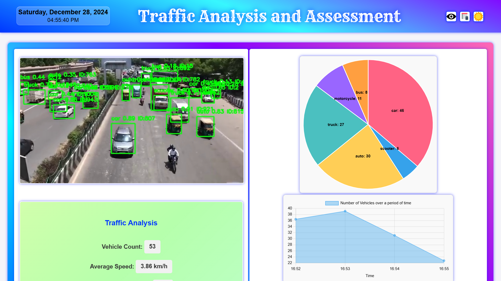
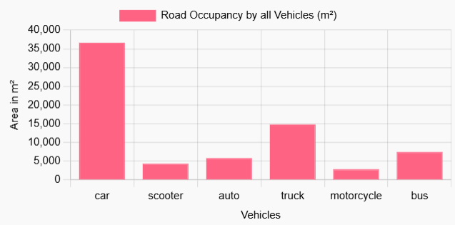

# **Vehicle Detection and Traffic Assessment using YOLO11L**

This project is a **real-time vehicle detection and traffic assessment system** built on a self-trained **YOLO11L model**. The system integrates advanced features like **data logging**, **visualization**, and **traffic analysis** to provide actionable insights into traffic conditions.

## 🖼️ **Preview**

## ✨ **Features**

### 🚘 **Vehicle Detection**
- Detects multiple vehicle types in real-time using a **combination of the base YOLO11L model** (for pre-trained classes) and **custom-trained YOLO11L model** (for added custom classes).

### 📋 **Data Logging**
- Logs detection data to **Google Sheets** for further analysis.
- Captures the following parameters:
  - **Timestamp**
  - **Bounding Box Coordinates** (X1, Y1, X2, Y2)
  - **Width and Height** of detected vehicles
  - **Class Name**
  - **Confidence Score**
  - **Track ID**

### 📊 **Data Visualization**
Provides real-time visual insights using **Chart.js**:
1. **Pie Chart**: Proportion of detected vehicle classes.
2. **Line Chart**: Number of vehicles detected over time.
3. **Bar Chart**: Vehicle classes with the most road occupancy, calculated by bounding box area.

### 🚦 **Traffic Insights**
Real-time calculations based on detection data:
- **Vehicle Count**: Total number of vehicles detected in the current frame.
- **Average Speed**: Estimates the speed of moving vehicles.
- **Traffic Jam Detection**: Identifies congestion based on density.
- **Heavy Vehicle Density**: Analyzes the proportion of heavy vehicles present.
- **Road Clearance Time**: Predicts the time required to clear the road.
- **Traffic Light Suggestions**: Recommends optimal traffic light timings based on vehicle density and flow.

## 🔄 **Workflow**

1. **Input Video Stream**:
   - The system uses YouTube streams as the input source.
   - Frames are extracted using OpenCV for processing.

2. **Detection and Analysis**:
   - The YOLO11L model detects vehicles and classifies them into predefined classes.
   - Detection results include bounding box dimensions, class names, confidence scores, and unique track IDs.

3. **Data Logging to Google Sheets**:
   - Detected data is dynamically updated in Google Sheets.
   - Utilizes Google Sheets API for seamless integration and real-time updates.

4. **Visualization**:
   - Chart.js fetches data from Google Sheets to render interactive charts.
   - Provides intuitive insights through pie, line, and bar charts.

5. **Traffic Insights Calculation**:
   - Algorithms calculate traffic-related metrics and predictions.
   - Displays results on the web interface for user interpretation.

## 🛠️ **Technical Overview**

### Backend
- **Flask Framework**: Handles application logic and APIs.
- **Flask-WTF**: Validates user inputs and forms.
- **Flask-Ngrok**: Facilitates local hosting for development purposes.
- **YOLO11L Model**: Custom-trained model for vehicle detection and classification.

### Frontend
- **Chart.js**: Enables dynamic data visualization.
- **HTML & CSS**: Renders the web interface.

### Libraries and Tools
- **OpenCV**: Processes video frames for detection.
- **Shapely**: Calculates geometric properties for bounding boxes.
- **yt_dlp**: Streams YouTube videos for input.
- **GSpread**: Integrates with Google Sheets for data logging.
- **Google Sheets API**: Facilitates real-time updates and data storage.

## 📤 **Example Outputs**

### **Detection Data Logged**
| **Timestamp**          | **X1**        | **Y1**       | **X2**        | **Y2**       | **Width**     | **Height**    | **Class Name** | **Confidence** | **Track ID** |
|------------------------|---------------|--------------|---------------|--------------|---------------|---------------|----------------|----------------|--------------|
| 21:49:05 1/1/2025      | 32.65145874   | 214.776062   | 124.6397705   | 275.8533325  | 91.98831177   | 61.07727051   | car            | 0.9123997688   | 1            |
| 21:49:05 1/1/2025      | 388.3595581   | 102.7689667  | 420.4992065   | 138.6712799  | 32.13964844   | 35.90231323   | scooter        | 0.8495836258   | 2            |
| 21:49:05 1/1/2025      | 62.71186829   | 150.5038757  | 96.41931152   | 185.9692078  | 33.70744324   | 35.46533203   | auto           | 0.8151150942   | 3            |
| 21:49:05 1/1/2025      | 157.4563141   | 140.8128662  | 195.0846405   | 168.6981506  | 37.62832642   | 27.88528442   | car            | 0.7732740045   | 4            |
| 21:49:05 1/1/2025      | 287.2844238   | 136.8283691  | 320.9523926   | 169.0031128  | 33.66796875   | 32.17474365   | car            | 0.7720789313   | 5            |

### **Visualization Charts**
- **Bar Chart**: Highlights vehicle classes with the most road occupancy based on their dimensions.
  

## 🚀 **Future Enhancements**

- **Integration with Traffic Management Systems**: Expand the system for live traffic control with live traffic stream from CCTVs and sensors.
- **Custom Class Expansion**: Train the model with additional vehicle classes for broader detection.

## 📝 **License**
This project is licensed under the **CC0 1.0 Universal**. See the [LICENSE](LICENSE.md) file for details.
