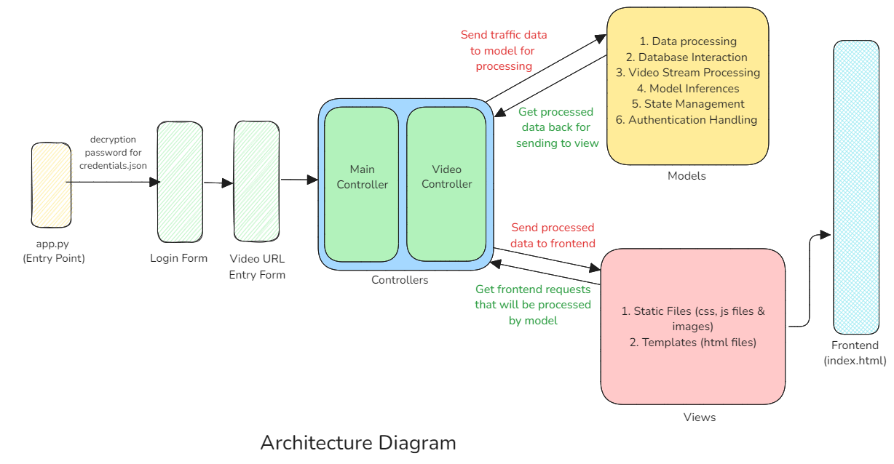

# 🚗 Vehicle Detection and Traffic Assessment using YOLO11L

> Real-time vehicle detection and traffic analysis system powered by a self-trained **YOLO11L model**, with live data logging, interactive visualizations, and intelligent traffic insights.


## 🖼️ Preview


## 📌 Table of Contents

- [Features](#-features)
- [Architecture](#-architecture)
- [Tech Stack](#️-tech-stack)
- [Getting Started](#-getting-started)
  - [Prerequisites](#prerequisites)
  - [Method 1 — Run Locally](#method-1--run-locally-apppy)
  - [Method 2 — Run via NGROK (Colab/Kaggle)](#method-2--run-via-ngrok-app_tunnelpy)
  - [Method 3 — Run with Docker](#method-3--run-with-docker-app_containerpy)
- [Credentials Setup](#-credentials-setup)
- [Example Output](#-example-output)
- [Future Enhancements](#-future-enhancements)
- [License](#-license)


## ✨ Features

### 🚘 Vehicle Detection
Detects multiple vehicle types in real-time using a **combination of the base YOLO11L model** (pre-trained COCO classes) and a **custom-trained YOLO11L model** (added Indian traffic classes like auto-rickshaws, scooters, etc.).

### 📋 Data Logging
Logs detection results live to **Google Sheets** with the following parameters:

| Parameter | Description |
|---|---|
| Timestamp | Time of detection |
| Bounding Box (X1, Y1, X2, Y2) | Pixel coordinates of detected vehicle |
| Width & Height | Dimensions of the bounding box |
| Class Name | Type of vehicle detected |
| Confidence Score | Model's prediction confidence |
| Track ID | Unique ID for tracking across frames |

### 📊 Data Visualization
Real-time interactive charts powered by **Chart.js**:
- **Pie Chart** — Proportion of each detected vehicle class
- **Line Chart** — Vehicle count over time
- **Bar Chart** — Road occupancy per vehicle class (by bounding box area)

### 🚦 Traffic Insights
Live traffic metrics calculated from detection data:
- **Vehicle Count** — Total vehicles in the current frame
- **Average Speed** — Estimated speed of moving vehicles
- **Traffic Jam Detection** — Congestion identification based on density
- **Heavy Vehicle Density** — Proportion of heavy vehicles
- **Road Clearance Time** — Predicted time to clear the road
- **Traffic Light Suggestions** — Optimal signal timing recommendations


## 🏗️ Architecture




## 🛠️ Tech Stack

| Layer | Technology |
|---|---|
| Object Detection | YOLOv11L (Ultralytics) |
| Backend | Flask, Flask-WTF, Flask-Ngrok |
| Frontend | HTML, CSS, Chart.js |
| Video Input | OpenCV, yt-dlp |
| Data Logging | GSpread, Google Sheets API |
| Geometry | Shapely |
| Containerization | Docker |
| Security | GnuPG (GPG) encryption |


## 🚀 Getting Started

### Prerequisites

- Python 3.10+
- GPG (GnuPG) v2.4.7+
- A Google Cloud Platform account with Sheets API enabled → [Setup Guide](https://developers.google.com/sheets/api/quickstart/python)
- Your `credentials.json` encrypted as `credentials.json.gpg` (see [Credentials Setup](#-credentials-setup))

Install dependencies:
```bash
pip install -r requirements.txt
```


### Method 1 — Run Locally (`app.py`)

Best for running on your **local machine**.

```bash
python app.py
```

The app will prompt you for the **GPG decryption password** in the terminal. After entering it, the application starts on `localhost`.


### Method 2 — Run via NGROK (`app_tunnel.py`)

Best for **Google Colab or Kaggle** environments where you need a public URL.

1. Create a free [NGROK account](https://ngrok.com/) and get your auth token.
2. Set the token as an environment variable in Colab/Kaggle:
   ```python
   import os
   os.environ["NGROK_AUTHTOKEN"] = "your_token_here"
   ```
3. Clone this repo and run:
   ```bash
   python app_tunnel.py
   ```
4. Enter the GPG decryption password when prompted. NGROK will generate a public URL to access the app.


### Method 3 — Run with Docker (`app_container.py`)

Best for **containerized or production deployments**.

> ⚠️ For Docker, your credentials file must be named `gauth-credentials.json` (not `credentials.json`) before encrypting.

```bash
docker compose up --build
```

The container automatically decrypts credentials and starts the app on **port 8087**.

To build and run manually:
```bash
docker build -t vehicle-detection .
docker run -p 8087:8087 vehicle-detection
```


## 🔐 Credentials Setup

This project uses Google Sheets API for data logging. The `credentials.json` from GCP is encrypted using **GPG** for security.

### Encrypt your credentials

```python
import gnupg
import getpass

gpg = gnupg.GPG()
passphrase = getpass.getpass("Enter passphrase for encryption: ")

input_file = "credentials.json"   # Your GCP credentials file
output_file = "credentials.json.gpg"

with open(input_file, "rb") as f:
    status = gpg.encrypt_file(
        f,
        recipients=None,
        output=output_file,
        symmetric=True,
        passphrase=passphrase
    )

if status.ok:
    print(f"Encrypted successfully: {output_file}")
else:
    print(f"Encryption failed: {status.status}")
```

Store the output `.gpg` file in the project root. The app will decrypt it at runtime when you enter the password.


## 📤 Example Output

### Detection Data Logged to Google Sheets

| Timestamp | X1 | Y1 | X2 | Y2 | Width | Height | Class | Confidence | Track ID |
|---|---|---|---|---|---|---|---|---|---|
| 21:49:05 1/1/2025 | 32.65 | 214.78 | 124.64 | 275.85 | 91.99 | 61.08 | car | 0.912 | 1 |
| 21:49:05 1/1/2025 | 388.36 | 102.77 | 420.50 | 138.67 | 32.14 | 35.90 | scooter | 0.850 | 2 |
| 21:49:05 1/1/2025 | 62.71 | 150.50 | 96.42 | 185.97 | 33.71 | 35.47 | auto | 0.815 | 3 |
| 21:49:05 1/1/2025 | 157.46 | 140.81 | 195.08 | 168.70 | 37.63 | 27.89 | car | 0.773 | 4 |
| 21:49:05 1/1/2025 | 287.28 | 136.83 | 320.95 | 169.00 | 33.67 | 32.17 | car | 0.772 | 5 |


## 🔮 Future Enhancements

- **Live CCTV Integration** — Replace YouTube streams with real CCTV feeds for live traffic control
- **Custom Class Expansion** — Train on additional vehicle classes for broader detection coverage
- **Traffic Management API** — Export insights to external traffic management systems


## 🤝 Contributing

Contributions are welcome! Feel free to open issues for bugs, feature requests, or new vehicle class ideas. Pull requests are appreciated.


## 📝 License

This project is licensed under the **CC0 1.0 Universal** (Public Domain). See the [LICENSE](LICENSE.md) file for details.