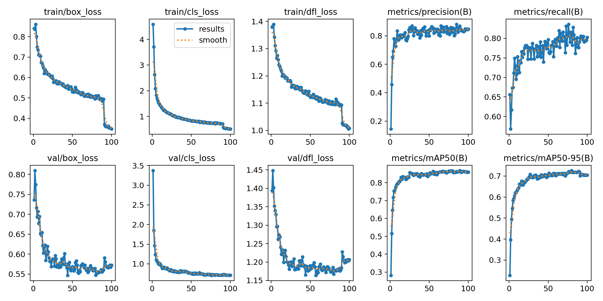
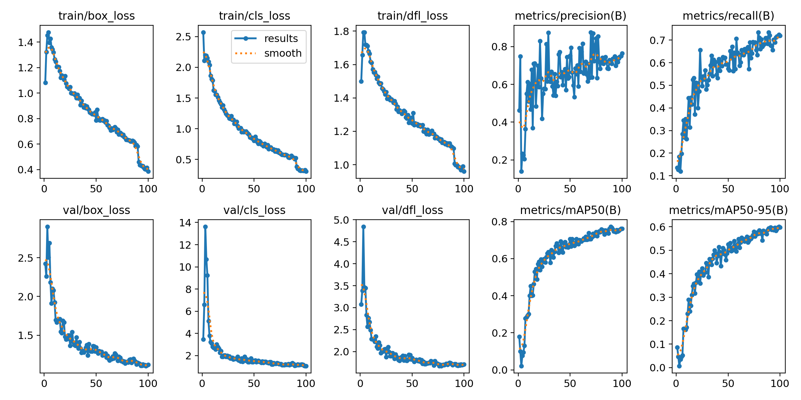

# Training

This repository provides an implementation of the **YOLOv11n** and **YOLOv11L** models based on [Ultralytics YOLO](https://docs.ultralytics.com/models/yolo11/).

## Model Overview

Specifications and performance of the base YOLOv11n and YOLOv11L models from Ultralytics:

| **Model**    | **Size (pixels)** | **mAPval 50-95** | **Speed (CPU ONNX)** | **Speed (T4 TensorRT10)** | **Params (M)** | **FLOPs (B)** |
|--------------|-------------------|------------------|-----------------------|---------------------------|----------------|---------------|
| YOLOv11n     | 640               | 39.5             | 56.1 ± 0.8 ms         | 1.5 ± 0.0 ms              | 2.6            | 6.5           |
| YOLOv11L     | 640               | 53.4             | 238.6 ± 1.4 ms        | 6.2 ± 0.1 ms              | 25.3           | 86.9          |

## Custom-Trained YOLOv11L Model

The **Custom-trained YOLOv11L model** supports detection for the **80 COCO classes** along with **5 additional custom classes** specifically for vehicle detection. These additional classes are:

- **80: JCB**
- **81: Auto**
- **82: Rickshaw**
- **83: Cart**
- **84: Scooter**

### Training Results

## For the **Custom-trained YOLOv11n model**:

#### Achieved Performance Metrics of YOLO11n on Testing Data

- **metrics/precision(B):** 0.85
- **metrics/recall(B):** 0.81
- **metrics/mAP50(B):** 0.88
- **metrics/mAP50-95(B):** 0.77
- **fitness:** 0.78
- **preprocess speed:** 0.18 s
- **inference speed:** 10.61 s
- **loss speed:** 0.00 s
- **postprocess speed:** 1.00 s

#### Class-Wise Performance Metrics YOLO11n on Testing Data

| **Class**  | **Images** | **Instances** | **Precision** | **Recall** | **mAP50** | **mAP50-95** |
|------------|------------|---------------|---------------|------------|-----------|--------------|
| all        | 244        | 333           | 0.85          | 0.81       | 0.89      | 0.77         |
| jcb        | 41         | 62            | 0.87          | 0.76       | 0.88      | 0.75         |
| auto       | 40         | 46            | 0.80          | 0.87       | 0.92      | 0.87         |
| rickshaw   | 29         | 43            | 0.81          | 0.74       | 0.81      | 0.69         |
| cart       | 57         | 65            | 0.80          | 0.75       | 0.83      | 0.62         |
| scooter    | 68         | 117           | 0.95          | 0.95       | 0.98      | 0.92         |

## For the **Custom-trained YOLOv11L model**:

#### Achieved Performance Metrics of YOLO11l on Testing Data

- **mAP50-95:** 59.5%
- **mAP50:** 66.2%
- **mAP75:** 61.3%

#### Class-Wise Performance Metrics YOLO11l on Testing Data

| **Class**     | **Precision** | **Recall** | **mAP50** | **mAP50-95** |
|---------------|---------------|------------|-----------|--------------|
| JCB           | 0.907         | 0.754      | 0.878     | 0.771        |
| Auto          | 0.913         | 0.766      | 0.909     | 0.807        |
| Rickshaw      | 0.862         | 0.728      | 0.868     | 0.811        |
| Cart          | 0.852         | 0.603      | 0.781     | 0.627        |
| Scooter       | 0.908         | 0.809      | 0.936     | 0.875        |

---