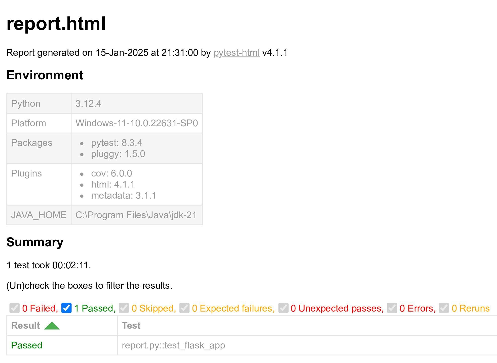

# Testing


| **Type of Testing**               | **Tool/Framework** | **Description**                                                   |
|-----------------------------------|--------------------|-------------------------------------------------------------------|
| **Backend Testing (Python)**      | pytest, coverage             | Testing Python code (e.g., Controllers, Models).       |
| **Frontend Testing (JavaScript)** | Jest               | Testing JavaScript code.  |
| **Web Browser Testing**           | Selenium           | Automating web browsers to perform end-to-end tests. |

## Backend Testing (Python-Flask)

To successfully reproduce the test results, ensure the following steps are followed:

1. **Disable or comment the `decrypt_file()` function in `app.py`.**
2. **In `main_controller.py`, disable or comment the `session.clear()` and `complete_stop()` functions.**
3. **In `video_controller.py`, disable or comment the `generate_frames()`.**


### **Pre-requisites for the Environment**

Ensure the following libraries are available in your environment for testing:


```sh
pip install pytest requests Flask pytest-cov coverage
```

### **To test Complete Code:**

```sh
pytest 
```
#### (Optional) For verbose and shows print() outputs during test execution 
```sh
pytest -vs    
```


### **To test Indiviual Modules:**

```sh
pytest tests/test_app.py     
```

```sh
 pytest tests/test_controllers/test_main_controller.py
```

```sh
pytest tests/test_controllers/test_video_controller.py
```

```sh
pytest tests/test_models/test_decryption.py
```

```sh
pytest tests/test_models/test_forms.py  
```

```sh
pytest tests/test_models/test_sheets.py
```

```sh
pytest tests/test_models/test_state.py
```

```sh
pytest tests/test_models/test_tracking.py  
```

```sh
pytest tests/test_models/test_youtube_stream.py
```

### For Coverage Testing
```sh
coverage run -m pytest
```
```sh
coverage report
```
| Name                                                   | Stmts | Miss | Cover |
|--------------------------------------------------------|-------|------|-------|
| tests\test_app.py                                      | 25    | 0    | 100%  |
| tests\test_controllers\test_main_controller.py         | 138   | 0    | 100%  |
| tests\test_controllers\test_video_controller.py        | 47    | 5    | 89%   |
| tests\test_models\test_decryption.py                   | 48    | 0    | 100%  |
| tests\test_models\test_forms.py                        | 23    | 0    | 100%  |
| tests\test_models\test_sheets.py                       | 87    | 1    | 99%   |
| tests\test_models\test_state.py                        | 23    | 0    | 100%  |
| tests\test_models\test_tracking.py                     | 83    | 0    | 100%  |
| tests\test_models\test_youtube_stream.py               | 25    | 0    | 100%  |
| **TOTAL**                                              | **499** | **6** | **99%** |

---

## Frontend Testing (Javascript)
### **Pre-requisites for the Environment**
### 1. **Set Up Jest for Your Project**

Since your app is primarily a Flask app but includes JavaScript testing:
1. Navigate to `tests/test_javascript` directory:
    ```bash
    cd my_flask_app/tests/test_javascript
    ```

2. Dependencies are already present in package.json, so install directly:
    ```bash
    npm i
    ```
3. (Optional) To update all the dependencies and devDependencies to their latest versions:
    ```bash
    npx npm-check-updates -u
    npm install
    ```

---

### 2. **Run Tests**

Run Jest from the `test_javascript` directory:
```bash
npm test
```

If Jest still complains about module imports, ensure you run the test with the experimental modules flag:
```bash
node --experimental-vm-modules ../../node_modules/.bin/jest
```


## Browser Testing (Selenium)

### **Pre-requisites for the Environment**

1. Download the ChromeDriver version that is compatible with your browser from the [ChromeDriver website](https://googlechromelabs.github.io/chrome-for-testing/).
   
2. Set up the path where you are running the application. For example, `https://localhost:5000`.

3. Run the main `app.py` file first.

4. Then, run the Selenium test file.

5. (Optional) Generate a report
```bash
pip install pytest pytest-html
```
```bash
pytest your_test_file.py --html=report.html
```

