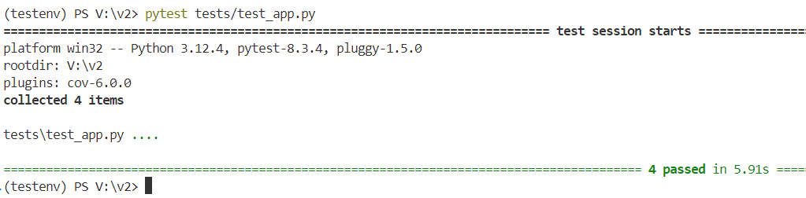
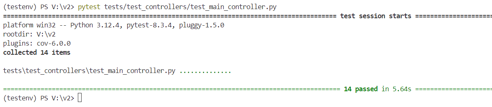
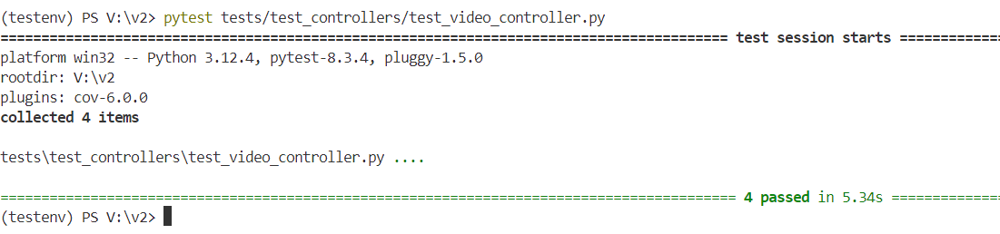
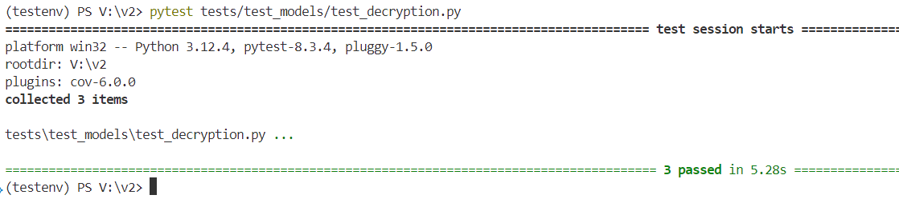
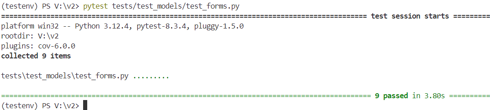
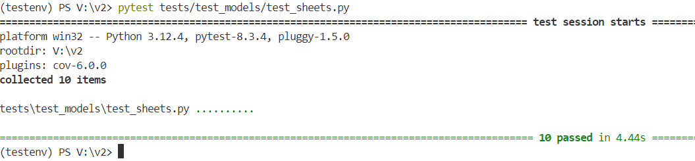
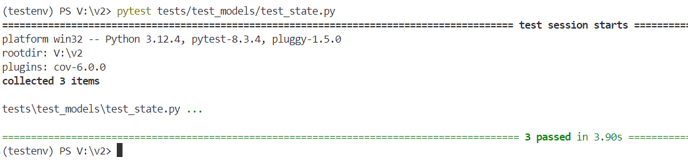
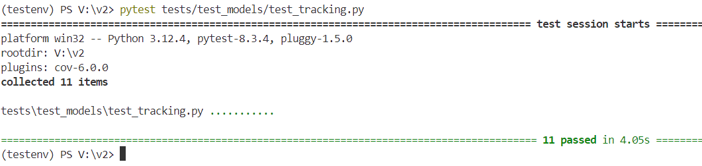
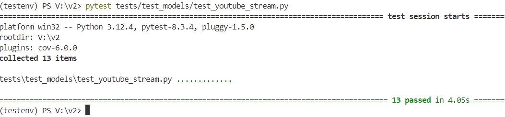

# **Pre-requisites to Reproduce the Test Results**  

To successfully reproduce the test results, ensure the following steps are followed:

1. **Disable or comment the `decrypt_file()` function in `app.py`.**
2. **In `main_controller.py`, disable or comment the `session.clear()` and `complete_stop()` functions.**
3. **In `video_controller.py`, disable or comment the `generate_frames()`.**


## **Pre-requisites for the Environment**

Ensure the following libraries are available in your environment for testing:

- **pytest** - A testing framework for Python used to write and run tests.
- **requests** - A library for making HTTP requests, commonly used to test REST APIs.
- **Flask** - A web framework for building web applications in Python, required for testing Flask applications.
- **pytest-cov** - A pytest plugin for measuring code coverage.
- **coverage** - A tool for measuring code coverage in Python.

```sh
pip install pytest requests Flask pytest-cov coverage
```

## **Testing Result:**

## **For Complete Code:**

```sh
pytest 
```
#### For verbose and shows print() outputs during test execution (Optional)
```sh
pytest -vs    
```


## **For Indiviual Modules:**

## app.py:
```sh
pytest tests/test_app.py     
```


## main_controller.py:
```sh
 pytest tests/test_controllers/test_main_controller.py
```


## video_controller.py:
```sh
pytest tests/test_controllers/test_video_controller.py
```


## decryption.py:
```sh
pytest tests/test_models/test_decryption.py
```


## forms.py:
```sh
pytest tests/test_models/test_forms.py  
```


## sheets.py:
```sh
pytest tests/test_models/test_sheets.py
```


## state.py:
```sh
pytest tests/test_models/test_state.py
```


## tracking.py:
```sh
pytest tests/test_models/test_tracking.py  
```


## youtube_stream.py:
```sh
pytest tests/test_models/test_youtube_stream.py
```


---
